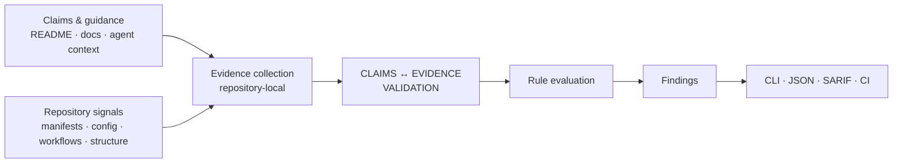

<p align="center">
  <picture>
    <source media="(prefers-color-scheme: dark)" srcset="https://raw.githubusercontent.com/tarekmasryo/Evagix/main/docs/assets/evagix-banner-dark.png">
    <source media="(prefers-color-scheme: light)" srcset="https://raw.githubusercontent.com/tarekmasryo/Evagix/main/docs/assets/evagix-banner-light.png">
    
  </picture>
</p>

<h1 align="center">Verify what your repository says against what it actually contains.</h1>

<p align="center">
  <strong>Local-first evidence validation for AI-assisted repositories.</strong>
</p>

<p align="center">
  Evagix checks documentation, commands, agent instructions, generated context,
  and repository claims against local evidence before developers, CI pipelines,
  or coding agents act on that information.
</p>

<p align="center">
  <a href="https://pypi.org/project/evagix/">
    
  </a>
  <a href="https://github.com/tarekmasryo/Evagix/actions/workflows/ci.yml">
    
  </a>
  <a href="https://pypi.org/project/evagix/">
    
  </a>
  
  <a href="https://github.com/tarekmasryo/Evagix/blob/main/LICENSE">
    
  </a>
</p>

<p align="center">
  <strong>Local-first</strong> ·
  <strong>Evidence-backed</strong> ·
  <strong>Agent-aware</strong> ·
  <strong>CI-friendly</strong> ·
  <strong>JSON / SARIF outputs</strong> ·
  <strong>Zero runtime dependencies</strong>
</p>

<p align="center">
  <a href="#quick-start">Quick start</a>
  ·
  <a href="#why-evagix">Why Evagix?</a>
  ·
  <a href="#what-evagix-validates">What it validates</a>
  ·
  <a href="#commands">Commands</a>
  ·
  <a href="https://evagix.readthedocs.io/">Docs</a>
  ·
  <a href="https://github.com/tarekmasryo/Evagix/blob/main/SECURITY.md">Security</a>
</p>

<p align="center">
  
</p>

---

## Quick start

Install Evagix from PyPI:

```bash
python -m pip install evagix
```

For an isolated CLI installation:

```bash
pipx install evagix
```

Run a repository readiness check:

```bash
evagix doctor .
```

Example output:

```text
Evagix Doctor

Status: PASS
Evagix Static Evidence Score: 100/100
Static evidence tier: clear
Required threshold: 80/100

Score breakdown:
  repository_readiness      100/100  [PASS]
  agent_context_governance  100/100  [PASS]
  pr_risk_readiness         100/100  [PASS]

Categories:
  agent_context     100/100  [PASS]
  commands          100/100  [PASS]
  ci                100/100  [PASS]
  docs_onboarding   100/100  [PASS]
  safety            100/100  [PASS]
  project_specific  100/100  [PASS]

Findings:
  [PASS ] No issues found.
```

Results depend on the repository being inspected.

For a broader local review:

```bash
evagix doctor .
evagix readme-audit .
evagix eval-context . --strict
evagix check .
```

The shorter `evgx` alias is also available:

```bash
evgx doctor .
```

Evagix supports Python 3.11, 3.12, 3.13, and 3.14 through its release CI matrix.

Evagix provides conservative local evidence checks for repository claims, documented commands, agent-facing context, and generated context.

---

## Why Evagix?

Modern repositories contain more than source code.

README files document setup and capabilities. CI files describe automation. `AGENTS.md` and other agent-facing files tell coding tools how to work with the repository. Generated context summarizes repository state for humans and AI systems.

Those sources can drift away from the repository they describe.

```text
README says: npm test
package.json has no matching test script
```

```text
README claims Docker support
no Dockerfile or Compose file exists
```

```text
AGENTS.md documents one test command
evagix.toml declares another
```

A developer or coding agent can then follow instructions that look authoritative but no longer match the repository.

Evagix checks those instructions and claims against repository-local evidence before they are trusted.

**Repository instructions are treated as evidence-backed artifacts, not trusted prose.**

Evagix is intentionally focused. It complements tests, CI, code review, static application security testing (SAST), secret scanning, and dependency auditing rather than replacing them.

---

<!-- evagix:audit-ignore-start -->

## What Evagix validates

Evagix collects local repository evidence and evaluates several related surfaces.

| Area                    | What Evagix checks                                                                                          | Example                                                                |
| ----------------------- | ----------------------------------------------------------------------------------------------------------- | ---------------------------------------------------------------------- |
| **README claims**       | Claims about tests, CI, Docker, packaging, deployment, typing, monitoring, and related capabilities         | Docker support is documented, but no Dockerfile or Compose file exists |
| **Commands**            | Install, test, lint, typecheck, build, evaluation, smoke, and application-run commands                      | `npm test` is documented, but no matching package script exists        |
| **Agent context**       | `AGENTS.md`, supported context files, canonical commands, conflicts, and unsafe guidance                    | `AGENTS.md` and `evagix.toml` define different test commands           |
| **Generated context**   | Missing, stale, unmanaged, modified, truncated, or invalid generated targets                                | Managed context no longer matches current repository evidence          |
| **Safety signals**      | Dangerous shell guidance, credential-bearing commands, environment exposure, and context-poisoning patterns | Agent instructions encourage risky access to local environment files   |
| **Repository evidence** | Languages, tests, migrations, tooling, workflows, infrastructure markers, and related signals               | A documented capability has weak or missing supporting evidence        |
| **CI and PR context**   | Workflow evidence and advisory changed-file risk signals                                                    | CI is claimed without matching workflow evidence                       |

<!-- evagix:audit-ignore-end -->

Findings are designed to explain:

* what was detected;
* what evidence supports the result;
* why it matters;
* and whether it should be fixed, reviewed, or deliberately waived.

See the complete [rule reference](https://github.com/tarekmasryo/Evagix/blob/main/docs/rules-reference.md).

---

## How it works



Evagix collects repository-local signals from documentation, configuration, manifests, workflows, command definitions, and agent-facing context. It validates documented claims and guidance against the available evidence, then applies deterministic rules and repository policy to produce findings for local review, CI, and automation.

Evagix performs **static repository inspection**.

By default, it does **not**:

* execute project test, lint, build, or application commands;
* install project dependencies;
* call model APIs;
* upload repository contents.

Static markers are evidence signals, not proof of high-impact claims such as `secure` or `production-ready`.

When evidence is incomplete, Evagix reports that uncertainty instead of manufacturing confidence.

---

## Commands

Most users only need a small part of the CLI.

| Goal                           | Command                         |
| ------------------------------ | ------------------------------- |
| Repository readiness           | `evagix doctor .`               |
| README evidence audit          | `evagix readme-audit .`         |
| Agent-context evaluation       | `evagix eval-context .`         |
| Generated-context verification | `evagix check .`                |
| Repository governance audit    | `evagix audit .`                |
| Generate context               | `evagix compile .`              |
| Preview synchronization        | `evagix sync . --plan`          |
| PR risk signals                | `evagix pr-risk . --base main`  |
| Explain a finding              | `evagix explain <finding-code>` |
| Export a report                | `evagix report .`               |

### Advanced commands

| Goal              | Command              |
| ----------------- | -------------------- |
| Baseline snapshot | `evagix baseline .`  |
| Baseline diff     | `evagix diff .`      |
| Scoped checks     | `evagix scoped .`    |

For the complete command inventory, flags, advanced workflows, and exit-code semantics, see [docs/commands.md](https://github.com/tarekmasryo/Evagix/blob/main/docs/commands.md).

### Strict gates

Evagix can start in reporting mode and later enforce explicit repository policy.

```bash
evagix doctor . --strict --fail-under 80
evagix readme-audit . --strict --fail-on unsupported
evagix eval-context . --strict --fail-on high
```

`--strict` enables stricter evaluation. It does not replace command-specific failure policy.

Thresholds such as `--fail-under` and selectors such as `--fail-on` determine when a configured gate fails.

This allows teams to inspect a repository first and introduce enforcement only after the expected policy is clear.

---

## CI

A conservative CI gate can run:

```bash
python -m evagix check .
python -m evagix doctor . --strict --fail-under 80
python -m evagix readme-audit . --strict --fail-on unsupported
python -m evagix eval-context . --strict --fail-on high
```

Evagix can also generate a downstream GitHub Actions workflow:

```bash
evagix init-ci . --fail-under 85
```

For gradual adoption:

1. run Evagix in reporting mode;
2. review the findings;
3. define the expected repository policy;
4. add strict thresholds where enforcement is appropriate.

`pr-risk` is advisory. It does not replace repository validation, tests, CI, dependency auditing, or human review.

### Pre-commit

Evagix provides hooks for downstream repositories:

```yaml
repos:
  - repo: https://github.com/tarekmasryo/Evagix
    rev: v0.1.1
    hooks:
      - id: evagix-check
      - id: evagix-doctor
```

---

## Configuration

Repository policy lives in `evagix.toml`.

```toml
[policy]
fail_on_stale = true
fail_under = 80

[commands]
test = "python -m pytest"
lint = "python -m ruff check ."
typecheck = "python -m mypy evagix"
```

Configuration can define:

* canonical repository commands;
* generated targets;
* policy thresholds;
* repository-specific validation behavior.

Evagix validates configuration before trusting it.

Invalid keys, empty commands, unsafe target paths, literal command credentials, and high-risk shell commands are rejected at the relevant boundary.

README examples can be excluded from claim analysis so example text is not automatically treated as a real repository claim.

Intentional policy waivers remain visible in results and do not become supporting evidence.

See [docs/configuration.md](https://github.com/tarekmasryo/Evagix/blob/main/docs/configuration.md).

---

## Outputs

Evagix supports human-readable and machine-readable output for local review, CI, and automation.

```bash
evagix doctor . --format json
evagix readme-audit . --format json
evagix eval-context . --format json
evagix report . --format sarif --output evagix.sarif --force
```

| Format       | Typical use                                      |
| ------------ | ------------------------------------------------ |
| **Text**     | Local inspection                                 |
| **JSON**     | CI and automation                                |
| **Markdown** | Human-readable reports                           |
| **SARIF**    | Code-scanning style integrations where supported |

Stable machine-readable contracts are documented in [docs/schemas.md](https://github.com/tarekmasryo/Evagix/blob/main/docs/schemas.md).

JSON output is not automatically a stable public contract. Stable outputs are the schema-backed formats documented by Evagix.

Evidence-sensitive reads are bounded. Truncated, unreadable, or invalid UTF-8 input is reported as incomplete instead of being treated as clean evidence.

---

## Generated context

Evagix can generate opt-in agent-facing context derived from repository evidence.

Neutral Evagix-managed targets include:

```text
.evagix/context.md
.evagix/context.json
```

Integrity state is stored separately in:

```text
.evagix/integrity.json
```

Generated context includes ownership and repository fingerprint information.

This allows `evagix check` to distinguish:

* repository changes that make generated context stale;
* manual modification of Evagix-managed context;
* cases where both conditions are present.

Tool-specific exports are **opt-in** and are generated only when explicitly requested or configured.

Compatibility with a tool-specific target format does not imply affiliation, endorsement, or sponsorship.

---

## Conservative behavior

Evagix intentionally avoids turning missing evidence into confidence.

* External or missing agent context remains unscored instead of receiving a positive structural score.
* Incomplete README reads do not become clean `100/100` results.
* Invalid UTF-8 and unreadable evidence are surfaced instead of silently ignored.
* Generated-context freshness and integrity are evaluated independently.
* Unsafe repository-internal symlink traversal is rejected.
* Policy waivers remain visible and do not create supporting evidence.
<!-- evagix:audit-ignore-start -->
* Static repository markers are not treated as proof of broad claims such as `secure` or `production-ready`.
<!-- evagix:audit-ignore-end -->

The goal is not to maximize scores. The goal is to keep conclusions proportional to the evidence available.

Exact rule semantics are documented in the [rule reference](https://github.com/tarekmasryo/Evagix/blob/main/docs/rules-reference.md).

---

## Installation

### PyPI

```bash
python -m pip install evagix
```

For an isolated CLI installation:

```bash
pipx install evagix
```

### Upgrade

With pip:

```bash
python -m pip install --upgrade evagix
```

With pipx:

```bash
pipx upgrade evagix
```

### From source

```bash
git clone https://github.com/tarekmasryo/Evagix.git
cd Evagix
python -m pip install -e ".[dev]"
```

Verify the installation:

```bash
evagix --version
evgx --version
```

---

## Supported environments

Evagix targets Python 3.11, 3.12, 3.13, and 3.14 through its release CI matrix.

It has **zero runtime dependencies**.

Repository scans do not require model APIs or network access.

Evagix can inspect repositories containing different languages and ecosystems, but it is not a deep language- or framework-specific analyzer.

New Python versions are considered supported after they enter the release matrix.

---

## Scope

Evagix has a deliberately narrow responsibility:

> Check whether repository-facing claims, instructions, commands, and managed context are supported by the local evidence available to developers and coding agents.

It complements existing engineering and security tooling.

Evagix is **not**:

* a test runner;
* a CI replacement;
* a semantic code analyzer;
* a full security scanner;
* a secret scanner;
* a dependency vulnerability auditor;
* a release approval system.

These boundaries are intentional. Evagix validates repository evidence and context; it does not attempt to prove the runtime correctness or security of an entire software system.

---

## Documentation

| Document                                    | Purpose                                                    |
| ------------------------------------------- | ---------------------------------------------------------- |
| [Commands](https://github.com/tarekmasryo/Evagix/blob/main/docs/commands.md)              | CLI workflows, flags, exit behavior, and advanced commands |
| [Configuration](https://github.com/tarekmasryo/Evagix/blob/main/docs/configuration.md)    | Repository policy and configuration                        |
| [Rules](https://github.com/tarekmasryo/Evagix/blob/main/docs/rules.md)                    | Rule overview                                              |
| [Rule reference](https://github.com/tarekmasryo/Evagix/blob/main/docs/rules-reference.md) | Complete rule semantics                                    |
| [Architecture](https://github.com/tarekmasryo/Evagix/blob/main/docs/architecture.md)      | Architecture boundaries and extension rules                |
| [Schemas](https://github.com/tarekmasryo/Evagix/blob/main/docs/schemas.md)                | Machine-readable contracts                                 |
| [Contributing](https://github.com/tarekmasryo/Evagix/blob/main/CONTRIBUTING.md)           | Development and contribution workflow                      |
| [Changelog](https://github.com/tarekmasryo/Evagix/blob/main/CHANGELOG.md)                 | Release history and notable changes                        |
| [Security](https://github.com/tarekmasryo/Evagix/blob/main/SECURITY.md)                   | Security policy and vulnerability reporting                |

For bugs, feature requests, or unexpected behavior, use [GitHub Issues](https://github.com/tarekmasryo/Evagix/issues).

---

## Development

Install the development dependencies:

```bash
python -m pip install -e ".[dev]"
```

Run the local quality gates:

```bash
python -m compileall -q evagix tests scripts
python -m ruff check .
python -m ruff format --check .
python -m mypy evagix
python -m pytest --cov=evagix --cov-branch --cov-report=term-missing --cov-fail-under=80
```

Evagix also validates itself through its own repository checks.

See [CONTRIBUTING.md](https://github.com/tarekmasryo/Evagix/blob/main/CONTRIBUTING.md) before contributing and [docs/architecture.md](https://github.com/tarekmasryo/Evagix/blob/main/docs/architecture.md) before making architectural changes.

---

## Security

Evagix is designed to inspect repository evidence conservatively and avoid unnecessary access to known secret-bearing file types.

It does not intentionally read `.env` files or private-key formats as ordinary repository evidence.

Command safety, path handling, sensitive-data redaction, and generated-context integrity are treated as explicit validation boundaries.

For vulnerability reporting and the full security policy, see [SECURITY.md](https://github.com/tarekmasryo/Evagix/blob/main/SECURITY.md).

---

## License

Evagix is licensed under the [Apache License 2.0](https://github.com/tarekmasryo/Evagix/blob/main/LICENSE).
