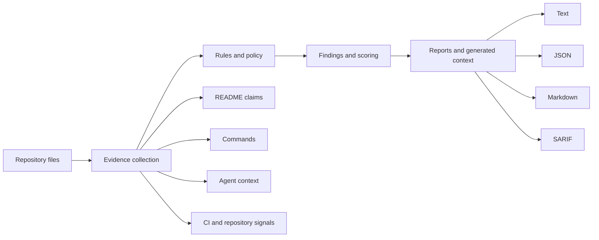

<h1 align="center">Evagix</h1>

<p align="center">
  <strong>Local-first evidence validation for AI-assisted repositories.</strong>
</p>

<p align="center">
  Evagix checks repository claims, documented commands, agent-facing instructions,
  and generated context against local evidence before humans or coding agents rely on them.
</p>

<p align="center">
  <a href="https://pypi.org/project/evagix/">
    
  </a>
  <a href="https://github.com/tarekmasryo/Evagix/actions/workflows/ci.yml">
    
  </a>
  
  
  <a href="https://github.com/tarekmasryo/Evagix/blob/main/LICENSE">
    
  </a>
</p>

<p align="center">
  <a href="#quick-start">Quick start</a>
  ·
  <a href="#core-commands">Commands</a>
  ·
  <a href="https://github.com/tarekmasryo/Evagix/tree/main/docs">Documentation</a>
  ·
  <a href="https://github.com/tarekmasryo/Evagix/blob/main/SECURITY.md">Security</a>
</p>

<p align="center">
  Evagix v0.1.0 provides conservative local evidence checks and
  CI-friendly repository validation.
</p>

---

## Why Evagix?

AI-assisted development increasingly depends on repository text: README files, agent instructions, CI notes, generated context, and documented commands.

Those instructions can drift away from the repository they describe.

```text
README says: npm test
package.json has no matching test script
```

```text
README claims Docker support
no Dockerfile or Compose file exists
```

```text
AGENTS.md documents one test command
evagix.toml declares another
```

Evagix treats repository instructions as evidence-backed artifacts rather than trusted prose.

```text
repository evidence
        ↓
rules + policy
        ↓
findings + scoring
        ↓
text / JSON / Markdown / SARIF
```

It is intentionally focused: Evagix validates repository-facing evidence and instructions. It does not replace tests, CI, code review, SAST, secret scanning, or dependency auditing.

---

## Quick start

Install:

```bash
python -m pip install evagix
```

Run the main checks:

```bash
evagix doctor . --strict --fail-under 80
evagix readme-audit . --strict --fail-on unsupported
evagix eval-context . --strict --fail-on high
evagix check .
```

The shorter `evgx` command is also available:

```bash
evgx doctor .
```

---

<!-- evagix:audit-ignore-start -->

## Typical findings

| Finding | Why it matters |
| --- | --- |
| README claims Docker support, but no Dockerfile or Compose file was found. | Prevents unsupported setup claims from being treated as repository fact. |
| README documents `npm test`, but no matching package script exists. | Flags stale commands before humans or agents copy them. |
| `AGENTS.md` and `evagix.toml` disagree about the canonical test command. | Surfaces conflicting agent instructions. |
| Generated context fingerprint no longer matches repository facts. | Detects context drift. |
| Agent-facing docs instruct tools to read local environment files. | Flags risky guidance around local secrets. |
| CI is claimed in documentation, but no workflow evidence exists. | Prevents readiness claims from being inferred without evidence. |

<!-- evagix:audit-ignore-end -->

---

## Install

### PyPI

```bash
python -m pip install evagix
```

For an isolated CLI installation:

```bash
pipx install evagix
```

Upgrade with:

```bash
python -m pip install --upgrade evagix
```

or:

```bash
pipx upgrade evagix
```

### From source

```bash
git clone https://github.com/tarekmasryo/Evagix.git
cd Evagix
python -m pip install -e ".[dev]"
```

Check the CLI:

```bash
evagix --version
evgx --version
```

Evagix requires **Python 3.11 or newer** and has **zero runtime dependencies**.

The release CI matrix validates Python 3.11, 3.12, 3.13, and 3.14. Newer interpreter versions are considered supported only after they enter that matrix.

---

## What Evagix checks

Evagix works from repository-local evidence.

| Area | What it looks for |
| --- | --- |
| README evidence | Unsupported or weakly supported claims about tests, CI, Docker, packaging, deployment, typing, monitoring, and related capabilities |
| Commands | Install, test, lint, typecheck, build, eval, smoke, and application-run evidence |
| Agent context | `AGENTS.md`, supported tool-specific context files, conflicts, unsafe instructions, and missing canonical commands |
| Generated context | Missing, stale, unmanaged, tampered, truncated, or invalid generated targets |
| Safety signals | Dangerous shell guidance, credential-bearing commands, environment exposure, and context-poisoning patterns |
| Repository signals | Languages, tests, migrations, tooling, infrastructure markers, and related readiness evidence |
| CI / PR context | Workflow evidence and advisory changed-file risk signals |

Findings are designed to explain what was detected, what evidence supports it, why it matters, and what should be fixed or deliberately waived.

See the complete [`rule reference`](https://github.com/tarekmasryo/Evagix/blob/main/docs/rules-reference.md).

---

## Core commands

| Goal | Command |
| --- | --- |
| Repository readiness | `evagix doctor . --strict --fail-under 80` |
| README evidence audit | `evagix readme-audit . --strict --fail-on unsupported` |
| Agent-context evaluation | `evagix eval-context . --strict --fail-on high` |
| Generated-context verification | `evagix check .` |
| Generate context | `evagix compile . --force` |
| Preview synchronization | `evagix sync . --plan` |
| Repository audit | `evagix audit .` |
| PR risk signals | `evagix pr-risk . --base main` |
| Explain a finding | `evagix explain missing-ci` |
| Export a report | `evagix report .` |

Additional commands for baselines, scoped checks, context packs, evidence export, and automation are documented in [`docs/commands.md`](https://github.com/tarekmasryo/Evagix/blob/main/docs/commands.md).

`--strict` enables stricter gate behavior. Failure thresholds are controlled by command-specific options such as `--fail-under`, `--fail-on high`, and `--fail-on unsupported`.

`pr-risk` is advisory and does not replace repository checks, tests, CI, or human review.

### Advanced commands

| Goal | Command |
| --- | --- |
| Baseline snapshot | `evagix baseline .` |
| Baseline diff | `evagix diff .` |
| Scoped checks | `evagix scoped .` |
| Context pack | `evagix context-pack .` |

---

## How it works



Evagix does **not** execute project commands while scanning, install project dependencies, call model APIs, or upload the repository.

Static markers are evidence signals, not proof of high-impact claims such as `secure` or `production-ready`. When local evidence is insufficient, Evagix keeps the result weak, partial, unsupported, or subject to manual review instead of manufacturing certainty.

---

## Reports and outputs

```bash
evagix doctor . --format json
evagix readme-audit . --format json
evagix eval-context . --format json
evagix report . --format sarif --output evagix.sarif --force
```

| Format | Typical use |
| --- | --- |
| Text | Local review |
| JSON | Automation and CI parsing |
| Markdown | Human-readable reports |
| SARIF | Code-scanning style integrations where supported |

Evidence-sensitive reads are bounded. Truncated, unreadable, or invalid UTF-8 input is reported as incomplete rather than being treated as clean evidence.

---

## CI usage

A conservative CI gate can run:

```bash
python -m evagix check .
python -m evagix doctor . --strict --fail-under 80
python -m evagix readme-audit . --strict --fail-on unsupported
python -m evagix eval-context . --strict --fail-on high
```

For gradual adoption, start with reporting-only output, review the findings, then add strict thresholds when the repository policy is ready to enforce them.

---

## Configuration

`evagix.toml` defines canonical commands, generated targets, and policy thresholds.

```toml
[policy]
fail_on_stale = true
fail_under = 80

[commands]
test = "python -m pytest"
lint = "python -m ruff check ."
typecheck = "python -m mypy evagix"
```

Configuration is validated before it is trusted. Invalid keys, empty commands, unsafe target paths, literal command credentials, and high-risk shell commands are rejected at the relevant boundary.

README examples can be excluded from claim analysis, while intentionally waived real claims remain visible in results.

See [`docs/configuration.md`](https://github.com/tarekmasryo/Evagix/blob/main/docs/configuration.md).

---

## Generated context

Evagix can create opt-in agent-facing context for `AGENTS.md`-compatible workflows and supported tool-specific targets.

Neutral Evagix-managed context targets include:

```text
.evagix/context.md
.evagix/context.json
```

Generated context carries ownership and fingerprint information.

Evagix records integrity state separately in:

```text
.evagix/integrity.json
```

This allows `evagix check` to detect stale context and manual modification independently, and to report both when appropriate.

Tool-specific exports are generated only when explicitly requested or configured. Vendor names identify compatible target formats only; they do not imply affiliation, endorsement, or sponsorship.

---

## Conservative behavior

Evagix intentionally avoids turning missing evidence into confidence:

- External or missing agent context is unscored rather than receiving a positive structural score.
- Incomplete README reads do not become clean `100/100` results.
- Invalid UTF-8 and unsafe path conditions are surfaced instead of silently ignored.
- Generated context freshness and integrity are checked independently.
- Unsafe repository-internal symlink traversal is rejected.
- Policy waivers remain visible and do not create supporting evidence.

Exact semantics are documented in the [`rule reference`](https://github.com/tarekmasryo/Evagix/blob/main/docs/rules-reference.md).

---

## Supported environments

Evagix targets Python **3.11–3.14** through its release matrix.

It has zero runtime dependencies and does not require network access for repository scans.

Evagix can inspect repositories containing different languages and ecosystems, but it is not a deep language or framework analyzer.

---

## Scope

Evagix is not:

- a full security scanner;
- a secret scanner;
- a dependency vulnerability auditor;
- a semantic code analyzer;
- a test runner;
- a CI replacement;
- a release approval system.

It complements those tools by checking whether repository-facing instructions and claims are supported by local evidence available to humans and coding agents.

---

## Documentation

| Document | Purpose |
| --- | --- |
| [`docs/architecture.md`](https://github.com/tarekmasryo/Evagix/blob/main/docs/architecture.md) | Architecture boundaries and extension rules |
| [`docs/commands.md`](https://github.com/tarekmasryo/Evagix/blob/main/docs/commands.md) | Command guide and common workflows |
| [`docs/configuration.md`](https://github.com/tarekmasryo/Evagix/blob/main/docs/configuration.md) | Configuration reference |
| [`docs/rules.md`](https://github.com/tarekmasryo/Evagix/blob/main/docs/rules.md) | Rule overview |
| [`docs/rules-reference.md`](https://github.com/tarekmasryo/Evagix/blob/main/docs/rules-reference.md) | Complete rule reference |
| [`docs/schemas.md`](https://github.com/tarekmasryo/Evagix/blob/main/docs/schemas.md) | JSON schema notes |
| [`SECURITY.md`](https://github.com/tarekmasryo/Evagix/blob/main/SECURITY.md) | Security policy |
| [`CONTRIBUTING.md`](https://github.com/tarekmasryo/Evagix/blob/main/CONTRIBUTING.md) | Contribution workflow |

---

## Development

```bash
python -m pip install -e ".[dev]"
python -m ruff check .
python -m ruff format --check .
python -m mypy evagix
python -m pytest --cov=evagix --cov-branch --cov-report=term-missing --cov-fail-under=80
```

Architecture boundaries are documented in [`docs/architecture.md`](https://github.com/tarekmasryo/Evagix/blob/main/docs/architecture.md).

---

## Security

Evagix is designed to inspect repository evidence conservatively and avoid unnecessary access to known secret-bearing file types.

It does not intentionally read `.env` files or private-key formats as ordinary repository evidence.

For vulnerability reporting and security policy, see [`SECURITY.md`](https://github.com/tarekmasryo/Evagix/blob/main/SECURITY.md).

---

## License

Apache-2.0. See [`LICENSE`](https://github.com/tarekmasryo/Evagix/blob/main/LICENSE).
