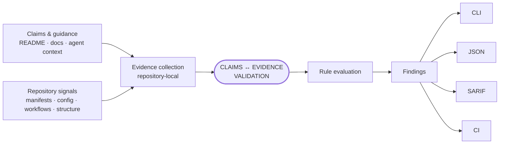

# How Evagix Works

Evagix is an evidence-validation layer for repositories that humans and AI coding tools rely on.

It answers a focused question:

> **Does the repository support what its documentation, commands, and agent-facing context claim?**

Evagix answers that question by inspecting repository-local evidence and evaluating it against explicit rules and policy.

## Evidence first

Evagix starts from repository-local evidence such as manifests, workflows, configuration, documentation, generated context, and supported command signals.

It prefers explicit evidence over inference. When evidence is incomplete, the safer result is `unknown`, incomplete, or review-required rather than a confident guess.

## Evidence flow

The validation path stays intentionally simple: repository signals are collected, claims are compared with available evidence, rules evaluate the result, and findings are exposed through human- and machine-readable outputs.



<p class="evagix-flow-traits">
  <span>Repository-local</span>
  <span>Deterministic</span>
  <span>Non-invasive</span>
</p>

Claims and repository evidence meet at the validation boundary. Rules turn that comparison into stable findings, and the same finding identity can flow consistently through CLI output, JSON, SARIF, waivers, and CI policy.

## Validation model

Normal Evagix scans inspect repository state without invoking the project's test, lint, build, deployment, or application commands. The result is a repository-local, deterministic, and non-invasive validation path.

Evagix focuses on whether repository claims are supported by inspectable evidence. Runtime execution, dependency auditing, and end-to-end security remain complementary layers handled by the tools that exercise those concerns directly.

For example:

- Evagix can identify that a documented command has no matching repository evidence.
- Runtime or CI execution determines whether that command actually succeeds.
- Evagix can identify stale or conflicting agent-facing instructions.
- Tests, security tooling, and human review provide complementary runtime and operational assurance.

## From findings to policy

Different commands use the same evidence for different decisions.

- `doctor` evaluates repository readiness.
- `readme-audit` evaluates README claims.
- `eval-context` evaluates agent-facing context.
- `check` validates Evagix-managed generated context.
- `evidence` and `scan` expose machine-readable facts for investigation.

CI failure is selected explicitly through the command's supported threshold or failure policy. `--strict` makes evaluation stricter; it is not a universal "fail on every finding" switch.

## Stable contracts

Evagix is designed so the same finding identity can travel across interfaces:

```text
finding.code
  == rule.id
  == SARIF ruleId
  == documented rule anchor
```

Stable JSON outputs are backed by packaged schemas and executable contract tests. Preview or experimental JSON is not considered stable merely because a command can emit JSON.

## Next

- [Quick Start](getting-started/index.md) — run the first useful checks.
- [CLI Reference](commands.md) — choose the right command.
- [Rules](rules.md) — understand severity and finding behavior.
- [Rule Reference](rule-index.md) — browse categories or look up an exact rule ID.
- [Schemas](schemas.md) — integrate machine-readable outputs.
- [Architecture](architecture.md) — implementation boundaries and extension points.
