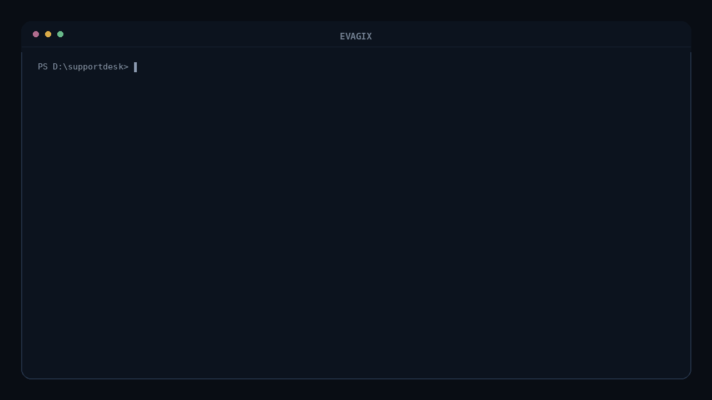

---
hide:
  - toc
---

<div class="evagix-home-brand" aria-label="Evagix">
  
  
</div>

<p class="evagix-home-tagline">Local-first evidence validation for AI-assisted repositories.</p>

# Verify repository claims against local evidence

Evagix checks documented capabilities, commands, agent-facing instructions, and managed context against evidence that exists in the repository before developers, CI pipelines, or coding agents rely on them.

<div class="evagix-home-actions">
  <a class="evagix-doc-button evagix-doc-button--primary" href="getting-started/">Quick Start</a>
  <a class="evagix-doc-button" href="commands/">CLI Reference</a>
  <a class="evagix-doc-button evagix-doc-button--quiet" href="https://github.com/tarekmasryo/Evagix">GitHub ↗</a>
</div>

<p align="center">
  
</p>

## Start here

```bash
python -m pip install evagix
evagix doctor .
```

`doctor` evaluates repository readiness from local evidence and reports the findings that contribute to the result.

[Open the Quick Start →](getting-started/index.md)

## The core idea

A repository can *say* one thing while its files support something else. Evagix makes that gap explicit.

<div class="evagix-evidence-example">
  <span class="evagix-evidence-label evagix-evidence-label--claim">CLAIM</span>
  <span class="evagix-evidence-label evagix-evidence-label--evidence">EVIDENCE</span>
  <span class="evagix-evidence-label evagix-evidence-label--finding">FINDING</span>

  <div class="evagix-evidence-value evagix-evidence-value--claim"><code>npm test</code></div>
  <div class="evagix-evidence-arrow evagix-evidence-arrow--one" aria-hidden="true"></div>
  <div class="evagix-evidence-value evagix-evidence-value--evidence"><strong>No matching test script</strong></div>
  <div class="evagix-evidence-arrow evagix-evidence-arrow--two" aria-hidden="true"></div>
  <div class="evagix-evidence-value evagix-evidence-value--finding"><strong>Documented command lacks repository support</strong></div>
</div>

Normal Evagix scans validate **repository-local evidence without executing project code**. This keeps the validation path deterministic and non-invasive while making gaps between documented claims and repository evidence explicit.

## What Evagix checks

| Surface | What Evagix validates |
| --- | --- |
| Repository claims | Whether documented capabilities are supported by repository-local evidence. |
| Commands | Whether install, test, lint, typecheck, build, and run guidance has matching evidence. |
| Agent context | Whether agent-facing instructions and managed context are consistent, current, and safe to rely on. |
| Generated context | Whether Evagix-managed context is present, fresh, owned, and untampered. |
| Automation contracts | Whether CI policy, exit behavior, and schema-backed outputs are explicit and stable. |

## Find what you need

- **New to Evagix?** Start with the [Quick Start](getting-started/index.md).
- **Need a command?** Use the [CLI Reference](commands.md).
- **Need repository policy?** Open [Configuration](configuration.md).
- **Adding Evagix to CI?** Use [CI Integration](guides/ci.md).
- **Investigating a finding?** Start with [Rules](rules.md) or look up the exact ID in the [Rule Reference](rule-index.md).
- **Building an integration?** Use the [Schemas](schemas.md) reference.
- **Want the mental model?** Read [How Evagix Works](concepts.md).
- **Maintaining the codebase?** See [Architecture](architecture.md).
